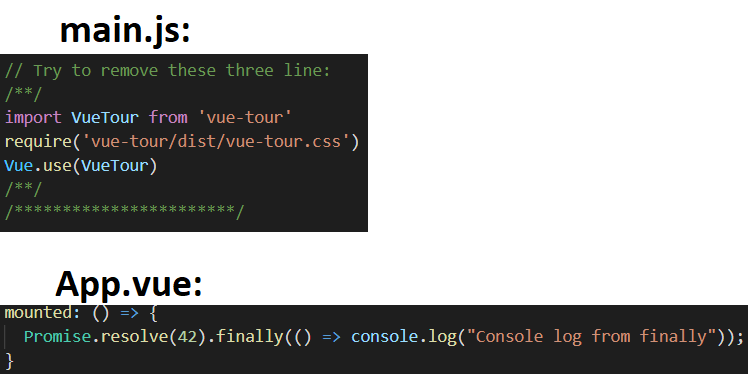
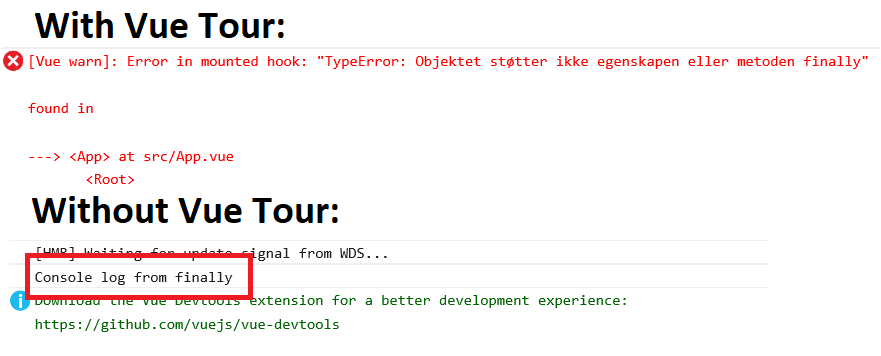

# vue-tour-breaks-polyfill-js

This repo is related to [this GitHub issue](https://github.com/pulsardev/vue-tour/issues/150). When importing Vue Tour, the polyfill for promise "finally" function breaks.

## Relevant code


## Error in console


## Project setup
```
npm install
```

### Compiles and hot-reloads for development
```
npm run serve
```